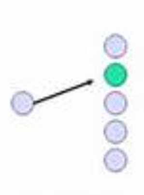
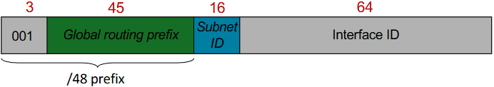
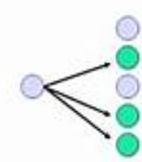
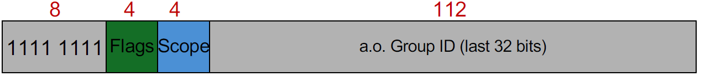
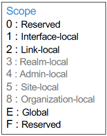
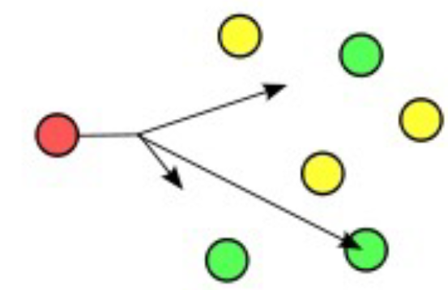

# adress types (4)

1) [UNICAST](#1-unicast)
2) [MULTICAST](#2-multicast)
3) [ANYCAST](#3-anycast)
4) [BROADCAST](#4-broadcast)

<!-- tabs:start -->

## **(1) UNICAST**

> ONE => ONE

## **(2) MULTICAST**

> ONE => MANY

### Address

> [!NOTE] Scope
>
> 

## **(3) ANYCAST**

> ONE => NEIREST NEIGBOUR

## **(4) BROADCAST**

> [!IMPORTANT] Broadcast is no longer available in IPv6

<!-- tabs:end -->
