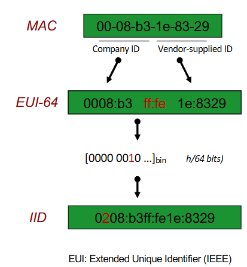
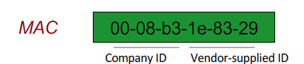

# Interface Identifier (IID)

> `64` bits
>
> Based on MAC address

## Formation

> [!NOTE] Mac address is 48 bits.

<!-- tabs:start -->

### **split the mac address in 2**

> 
> 
> **`MAC-COMPANY-ID`-`MAC-VENDOR-ID`**
> 
> **`00:08:B3`-`1e:83:29`**

### **Add 0xFFFE in bewteen**

> [!NOTE] the IID is `64` bits so we add and 2 bytes.

> 
> **`MAC-COMPANY-ID`-`MAC-VENDOR-ID`**
> 
> **`00:08:B3`-`FFFE`-`1e:83:29`**

> [!warning] correct notation (grouped by 4 nibbles):
>
> `0008:b3ff:fe1e:8329`

### **Flip the 7th bit (required by RFC/Standard)**

> `0008:b3ff:fe1e:8329` => `0208:b3ff:fe1e:8329`

<!-- tabs:end -->

> [!IMPORTANT] Static EUI-64 identifiers in IPv6 link a node to its unique MAC address, making users easily trackable across different networks.

