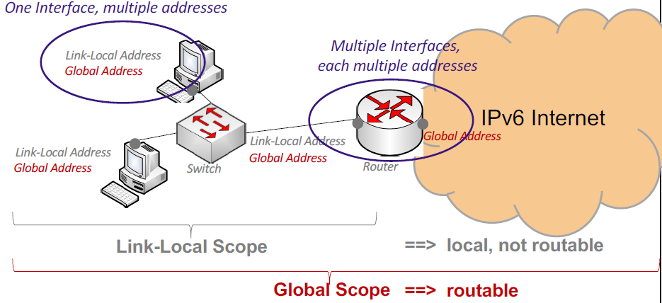
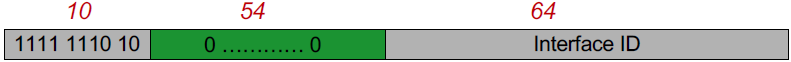
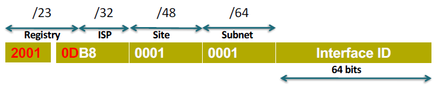
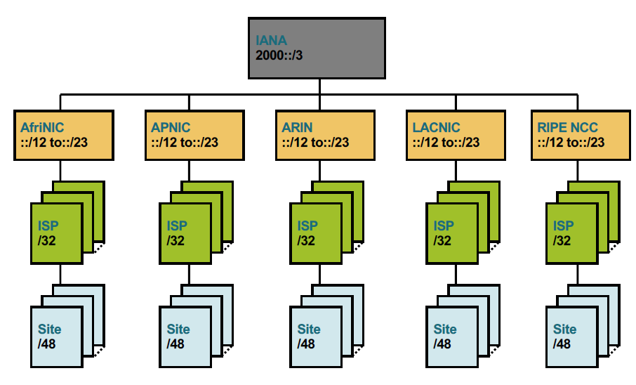

# multiple addresses

Most IPv4 interfaces have 1 address.

But with `IPv6 interfaces` generaly have `multiple addresses` with this a `new concept` was introduced: `address scope`.

## Address Scope (2)

<!-- tabs:start -->

### **Link Local**

> 1) Auto generated.
> 2) Generated at boot.
> 3) Prefix: fe80::/10
> 4) Practice: fe80::/64 (54 bits are all zero !)

### **Global Address Scope**

> 1) Prefix: 2000::/3
> 2) Allocated in /48 prefix ranges

> [!IMPORTANT] Standard recommendations suggest `allocating 48-bit prefixes to organizations` (ISPs or companies). This `leaves 16 bits available` within the network portion for `internal subnetting`.

#### Example Subnets

1) 2001:06a8:1d80:`0027`::/64 : servers
2) 2001:06a8:1d80:`1018`::/64 : test subnet ipv6 only

> [!NOTE] there are still (65536 - 2) subnets available
<!-- tabs:end -->

## IPv6 Hierarchical Allocation

IPv6 uses a **strictly hierarchical structure** to enable efficient **route aggregation**, preventing the "routing table bloat" seen in fragmented IPv4 distributions.

* `2000::/3`: Total Global Unicast space.
* `/23` **Registry**: Assigned to RIRs (Regional Internet Registries).
* `/32` **ISP Prefix**: Assigned to providers; supports **65k+** sites.
* `/48` **Site Prefix**: Assigned to customers (companies/universities).
* `/64` **Subnet**: 16 bits (49-64) allowing **65,536** subnets per site.
* **Interface ID**: Final 64 bits for host identification.

> [!NOTE]  
> High-level aggregation means Tier-1 routers only need to store broad `/23` or `/32` routes. Specific customer routes (`/48`) remain local to the ISP's network, keeping `global routing tables lean` and efficient.

### visualised

