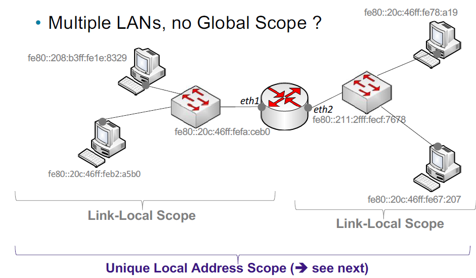
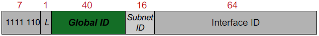

# Unique Local Address (ULA)

> [!NOTE] Structuring a `local network` with `multiple LANs`, `without global addresses`,
> can be done using the `Unique Local Address (ULA) scope`.

## structure

> [!NOTE] global prefix(L=0): `fc00::/8` = `b1111 1100/8`.
> **NOT DEFINED/ IN USE**

> [!NOTE] local prefix(L=1): `fd00::/8` = `b1111 1101/8`.
> Used when **ULA is generated localy**.

> [!IMPORTANT] `L bit` is **RESERVED**

## Scope And ID

> [!IMPORTANT] ULA scope is `routable` only within a `private network` or between a `limited set of ULA sites`.

> [!IMPORTANT] the `Global ID` is a `Pseudo random number` od **40 bits**.

