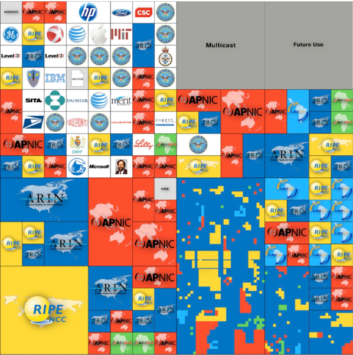

# address space

Ipv4 has a nettwork space of 32bits.

looking at the above image, we can see there is `none` left.

so we needed a fix: `IPv6`.

## Notation

> `128` bits
>
> `16` bytes
>
> **8** fields of **2 bytes**, separated by a colon `:`
>
> **2 bytes** per field: `hexadecimal` `0000:`
>
> Example: `2001:0660:30f3:AC01:0000:0000:6d43:210f`

### shorthand notation

writing IPv6 addresses can become very tedious.
-> Shorthand notation
<!-- tabs:start -->

#### **Step 1: Base format**

> 2001:0660:30f3:0001:0000:0000:6d43:210f

#### **Step 2: remove leading zero's**

> 2001:`0`660:30f3:`000`1:`000`0:`000`0:6d43:210f
>
> 2001:660:30f3:1:0:0:6d43:210f

#### **Step 3: replace consecutive zero’s**

> 2001:660:30f3:1:`0:0`:6d43:210f
>
> 2001:660:30f3:1`::`6d43:210f

> [!WARNING]only allowed once!

> [!WARNING]only when there are `2` or more `consecutive series`!

<!-- tabs:end -->

> [!NOTE]
> `IPv4 address` included in `last bytes `: dot-decimal allowed
> 
> 2001:0660:30f3:0001::`101.67.33.15`

## [IID](InterfaceIdentifier.md)

The last 64bits of an IPv6 address are used to form an Interface Identifier (IID) within a
network.
