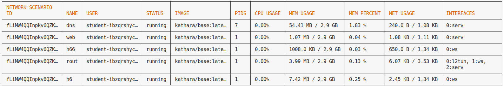
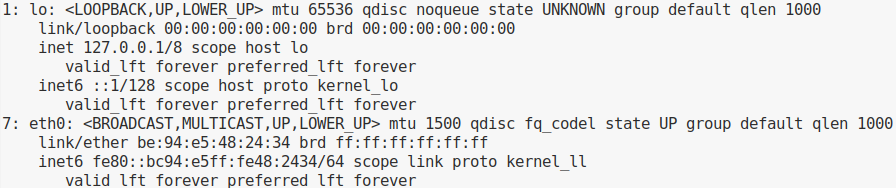
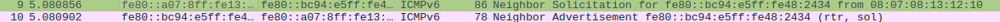
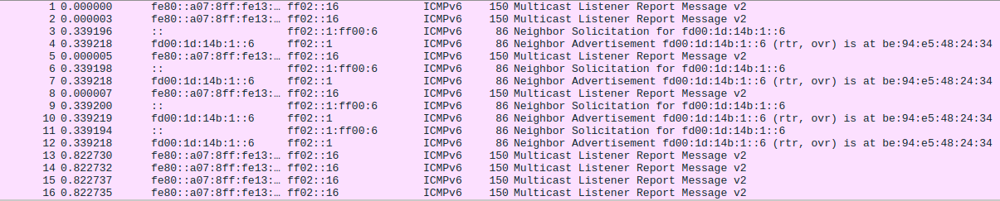
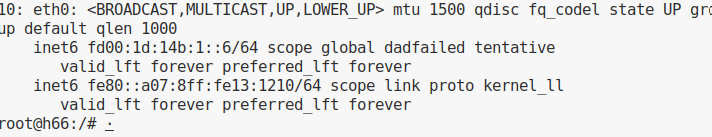
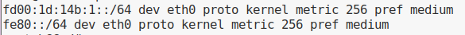
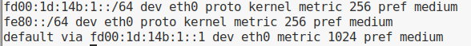
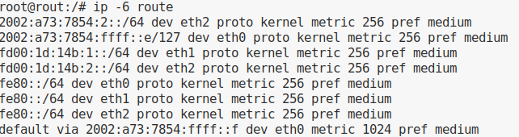

# lab IPv6

> [!NOTE] kathara nodes are docker vm's (so linux commands apply)

## setup

### setup script

```bash
wget http://157.193.215.171/cnet2ipv6.sh
bash cnet2ipv6.sh 01 # see scores for group number!
```

### configuration of env

In this lab, you will emulate four nodes and an (IPv6) router using kathara.

```bash
cd ipv6lab
#in ipv6lab folder
sudo kathara lstart
kathara linfo
```



> [!NOTE]
> login can be done using the following command:
>
> ```bash
> kathara connect rout
> ```

> [!IMPORTANT]
> to use tcpdump you need to use the provided capNode.sh script:
>
> ```bash
> ./capNode.sh -n rout -i eth1
> ```

## 1 local IPv6 connectivety

### 1.1 link-local IPv6



#### reflection

##### A

> `What kind of address is it? How do you recognize it?`

```bash
link/ether be:94:e5:48:24:34 brd ff:ff:ff:ff:ff:ff
    inet6 fe80::bc94:e5ff:fe48:2434/64 scope link proto kernel_ll 
       valid_lft forever preferred_lft forever
```

> `MAC`: **be:94:e5:48:24:34**
>
> `EUI-64`: **bc94:e5ff:fe48:2434**

> this is link-local IPv6 address (can be recognized by the `fe80` prefix)

##### B

> `Using the MAC address of h66 (08:07:08:13:12:10), can you predict the IPv6 link local address? You can assume that Linux uses the EUI-64 format.`

1) split: in OUI and VENDOR-ID
2) 08:07:08 - 13:12:10
3) insert fffe
4) 0807:08ff:fe13:1210
5) flip bit 7 (0000 1100) => 0A => `fe80::0A07:08ff:fe13:1210`

##### C

> Did you need to actively configure the address

no because the IPv6 addr is autogenerated using SLAAC etc. using the macaddr and the prefix we got from our ISP.

#### question 1:

> Explain how the address resolution works: what destination addresses are used
and why. Compare the IPv4 and IPv6 address resolution mechanism.



1) IPv4 (ARP)
on ipv4 an ARP message was broadcast across the network and then the corresponding interface responded with its IP-address. this is innefecient as all the nodes on the network have to handle the package.

2) IPv6 (NDP, Neighbour Discovery Protocol)

> using multicast is sends a `neighbour solicitation` message to the corresponding IPv6 ADDR.

> the receiver/dest interface then responds with a `neighbour advertisement`

>On the router, add address fe80::1/64 to interface eth1. Verify that you can also ping this address from h6
>
> ```bash
> #rout terminal
>ip -6 addr add fe80::1/64 dev eth1
> ```
>
> ```bash
> #h6 terminal
>ip -6 addr add fe80::1/64 dev eth1
> ```

#### question 2:

> `Which multicast addresses are relevant for address resolution?`
Solicited-Node Multicast Address:

1) ff02::1:ff48:2434

### 1.2 Static ULA IPv6 Addresses

| Hostname | IP Address        | NIC  |
| -------- | ----------------- | ---- |
| Router   | fd00:1d:14b:1::1  | eth1 |
| Host h6  | fd00:1d:14b:1::6  | eth0 |
| Host h66 | fd00:1d:14b:1::66 | eth0 |

#### question 3

> Explain what happens when adding the address to the interface.

two `multicast listener v2` messages get sent.

1 for: `Joining the "All-Nodes" Multicast (ff02::1)`

2 for: `Joining the "Solicited-Node" Multicast (ff02::1:ff00:6)`

> The router was already configured with an ULA address in this LAN. Can you ping his
address?

No because this address is not in our `routing table` and it is not a multivast address

### 1.3 Static ULA IPv6 Addresses - DAD

#### reflection:



> Explain how IPv6 makes sure that no duplicate addresses are possible - see the traffic in your WireShark trace!

h66 sends out a solicitation message anouncing: i want claim this ip...

h6 then notices that h66 is trying to claim it's IP addr and responds with a advertisement message wich tells h66: hey this is in use.



> ```bash
> ip -6 addr add fd00:1d:14b:1::66/64 dev eth0
> ```

### 1.4 ULA IPv6 Addresses - routing

> Have a look at the routing table of e.g. host h6. Why are you not able to reach this
server?



No we cannot reach the DNS sever because there is no default gateway set, as the dns server is across the router.

> `ip -6 route add default via fd00:1d:14b:1::1`



## 2 Connecting to the IPv6 Internet

### 2.1 verify the router



we need to look for a 2002 Ipv6-4 transfer address.
the prefix will be the 32 remaining bytes wich is the provided IPv4 addr from the ISP.

> 2002:a73:7854 => 0a.73.78.54 => 10.115.120.84

Test your connectivity by pinging an IPv6 host, like ipv6.google.com or www.he.net.

> this won't work because we got no `Global Unicast Address`

### 2.2 GUA for the hosts - static

#### reflection

>What is the length of the subnet we should distribute to our hosts? How many subnets can we hence create in our new IPv6 network? The first subnet available shall be used for the configuration of your clients LAN

answer /64 => 2^16 subnets 65535 subnets

#### ETH1 router

mac: `52:3e:b8:00:2a:56`
EUI-54: 523e:b8ff:fe00:2a:56 => flip bit 7 (0101 0000) => 503e:b8ff:fe00:2a:56
prefix: 2002:a73:7854:1
GUA: 2002:a73:7854:1:503e:b8ff:fe00:2a56/64

#### H6

EUI-64: `fe80::0A07:08ff:fe13:1210`
prefix: 2002:a73:7854:1

GUA:  2002:a73:7854:1:0A07:08ff:fe13:1210/64

> Reflection: Why can’t we ping a hostname?
>
> because the DNS server has not been set